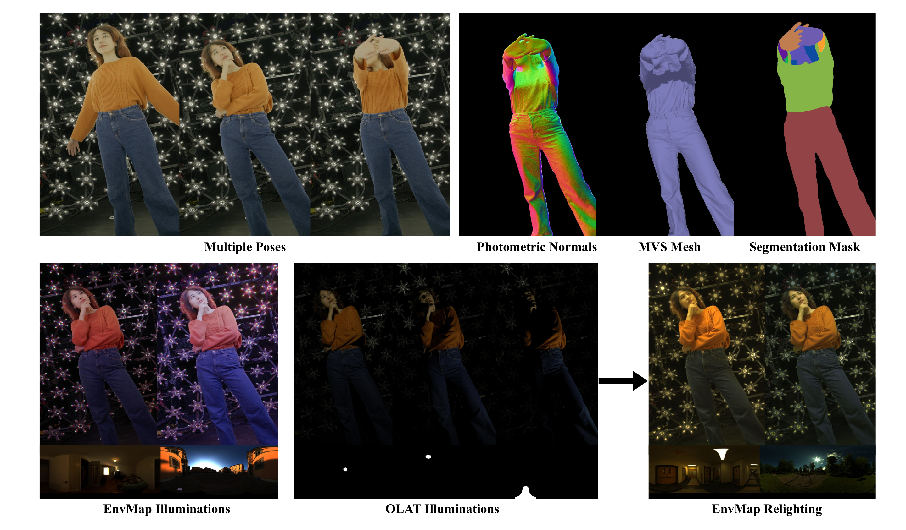

<div align="center">
   <!--Layout adapted from https://github.com/vivoCameraResearch/SDMatte-->
  <h1 align="center"><i>HumanOLAT</i>: A Large-Scale Dataset for Full-Body Human Relighting and Novel-View Synthesis </h1>

  <p align="center">
    <b>
      Timo Teufel<sup>1*</sup>, Pulkit Gera<sup>1*</sup>, Xilong Zhou<sup>1</sup>,
      Umar Iqbal<sup>2</sup>, Pramod Rao<sup>1</sup>,<br>
      Jan Kautz<sup>2</sup>, Vladislav Golyanik<sup>1</sup>,Christian Theobalt<sup>1</sup>
    </b><br>
    <sup>1</sup> Max Planck Institute for Informatics,SIC&nbsp;&nbsp;&nbsp;
    <sup>2</sup> NVIDIA<br>
    <sup>*</sup> Equal contribution &nbsp;&nbsp;&nbsp;
  </p>

  [](https://vcai.mpi-inf.mpg.de/projects/HumanOLAT/)
  [](https://en.wikipedia.org/wiki/Coming_Soon)
  [](https://gvv-assets.mpi-inf.mpg.de/HumanOLAT/)
  
  <strong>Official repository for code, tools and information related to the <i>HumanOLAT</i> dataset.</strong>

  <div style="width: 100%; text-align: center; margin:auto;">
      
  </div>

  <strong>For any questions, please contact Timo Teufel tteufel@mpi-inf.mpg.de.</strong>

</div>

## Abstract

Simultaneous relighting and novel-view rendering of digital human representations is an important yet challenging task with numerous applications. However, progress in this area has been significantly limited due to the lack of publicly available, high-quality datasets, especially for full-body human captures. To address this critical gap, we introduce the HumanOLAT dataset, the first publicly accessible large-scale dataset providing multi-view One-Light-at-a-Time (OLAT) captures of full-body humans. The dataset includes HDR RGB frames under various illumination conditions, such as white light, environment maps, color gradients and fine-grained OLAT illuminations. Our evaluations on state-of-the-art relighting and novel-view synthesis methods underscore both the dataset's value and the significant challenges still present in accurately modeling complex human-centric appearance and lighting interactions. We believe that HumanOLAT will significantly facilitate future research, enabling rigorous benchmarking and advancements in both general and human-specific relighting and rendering techniques. 

## Contents
1. [Quick Start](#quick-start)
2. [Code and Tools](#code-and-tools)
3. [Processing Raw Data](#processing-raw-data)
4. [Citation](#citation)
5. [Acknowledgements](#acknowledgements)
6. [TODOs](#todos)

## Quick Start

To access the dataset, navigate to the authentication site by going to https://gvv-assets.mpi-inf.mpg.de/, searching for "HumanOLAT" and clicking on the button "Software". Afterwards, register a new account and supply the requested information. Please note that we require everyone who wishes to access to access the dataset to apply using an **institutional e-mail address** and **describe the intended usage in detail** (i.e. not just "research").

After your account has been approved, simply login and download the parts of the dataset which interest you. In general, we recommend downloading the `processed_data.tar` file (10GB), which contains the entire dataset stored using undistorted, masked and motion corrected 1K `.avif` files.

Due to large storage requirements, some `.tar` files are split into chunks of 100GB. Once you have downloaded all parts belowing to one `.tar`, you can extract the data using

```cat /PATH/TO/DOWNLOAD/{TAR_NAME}.tar.gz.part* | tar -xzvf - -C /PATH/TO/OUTPUT```

Please view the `DATASHEET.md` for detailed information on the contents of the dataset.  

## Code and Tools

Please view the [Code](https://github.com/TMT22/HumanOLAT/tree/main/code) directory for information on available code and tools.

## Processing Raw Data

(COMING SOON) Information on how to process the raw .RED files will be added soon.

## Citation

If you find this dataset useful for your research, please consider staring this repo and citing
```
@inproceedings{teufelgera2025HumanOLAT,
  title = {HumanOLAT: A Large-Scale Dataset for Full-Body Human Relighting and Novel-View Synthesis},
  author = {Timo Teufel and Pulkit Gera and Xilong Zhou and Umar Iqbal and Pramod Rao and Jan Kautz and Vladislav Golyanik and Christian Theobalt},
  year = {2025},
  journal={International Conference on Computer Vision (ICCV)}
}
```

## Acknowledgements

This research was supported by NVIDIA.

## TODOs

- [x] Add information on how to access the dataset 
- [x] Add sources for code and tools
- [ ] Add information on how to process raw data

